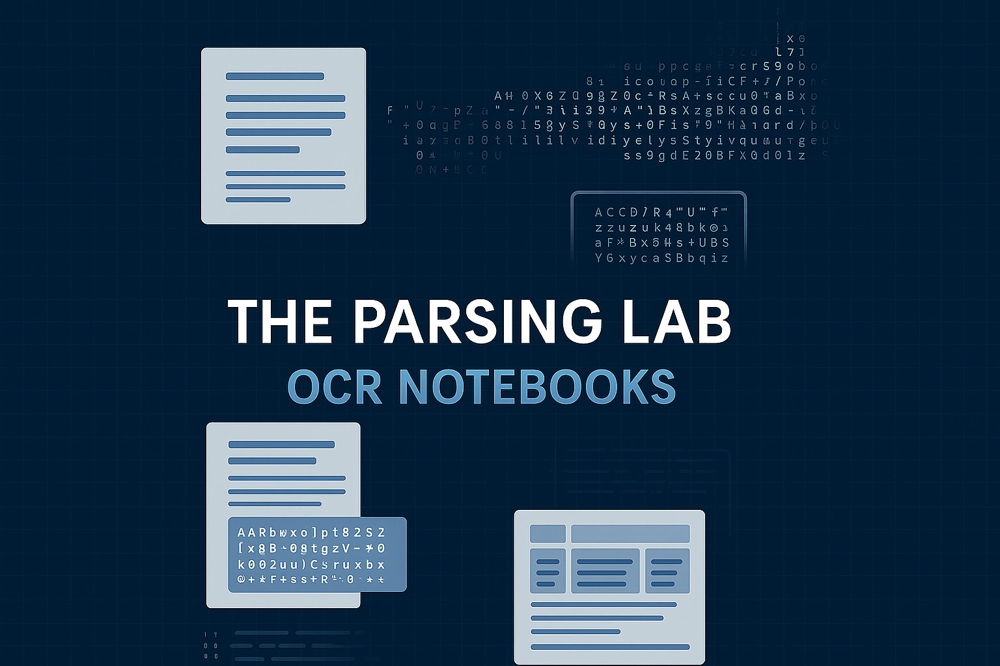

# 📝 Laboratorio de Análisis de Documentos


Una colección curada de cuadernos Jupyter para experimentar con técnicas de vanguardia en OCR, análisis de documentos, extracción de tablas y comprensión de gráficos. Este repositorio permite realizar benchmarks prácticos y facilitar el uso de las soluciones más recientes de código abierto y basadas en la nube para el procesamiento de imágenes de documentos.

---

## 🚀 Inicio Rápido con Doctra

Esta sección proporciona una guía de inicio rápido para comenzar a usar **Doctra**, una poderosa herramienta para el análisis estructurado de documentos sin modelos de lenguaje visual (VLM). Aprende a analizar documentos PDF, extraer contenido estructurado (texto, tablas, gráficos, figuras) y generar múltiples formatos de salida.

| Cuaderno                                                                                                                                                                            | Descripción                                                         |
| ----------------------------------------------------------------------------------------------------------------------------------------------------------------------------------- | ------------------------------------------------------------------- |
| [01_doctra_quick_start.ipynb](https://github.com/AdemBoukhris457/Documents-Parsing-Lab/blob/main/01_doctra_quick_start.ipynb)                                 | Guía de inicio rápido para el análisis estructurado de documentos con **Doctra**         |

---

## 📚 Resumen de los Cuadernos

| Cuaderno                                                                                                                                                                            | Descripción                                                         |
| ----------------------------------------------------------------------------------------------------------------------------------------------------------------------------------- | ------------------------------------------------------------------- |
| [bytedance-dolphin-image-parsing.ipynb](https://github.com/AdemBoukhris457/Documents-Parsing-Lab/blob/main/bytedance-dolphin-image-parsing.ipynb)                                 | Análisis de páginas de documentos con **Dolphin** de ByteDance                 |
| [Llama-3.1-Nemotron-Nano-VL-8B-V1_parsing_documents.ipynb](https://github.com/AdemBoukhris457/Documents-Parsing-Lab/blob/main/Llama-3.1-Nemotron-Nano-VL-8B-V1_parsing_documents.ipynb)                                 | Evaluación del rendimiento del análisis de documentos con **Llama-3.1-Nemotron-Nano-VL-8B-V1**                 |
| [docling-documents-parsing-and-tables-extraction.ipynb](https://github.com/AdemBoukhris457/Documents-Parsing-Lab/blob/main/docling-documents-parsing-and-tables-extraction.ipynb) | Análisis y extracción de tablas con **Docling**                       |
| [typhoon-ocr-7b-docs-pages-parser.ipynb](https://github.com/AdemBoukhris457/Documents-Parsing-Lab/blob/main/typhoon-ocr-7b-docs-pages-parser.ipynb) | Evaluación de las capacidades de análisis de documentos de **Typhoon_ocr_7b** en varios casos de uso                    |
| [florence-2-large-ocr-documents-pages.ipynb](https://github.com/AdemBoukhris457/Documents-Parsing-Lab/blob/main/florence-2-large-ocr-documents-pages.ipynb)                       | OCR de páginas de documentos usando **Florence 2 Large**                    |
| [florence-2-large-ocr-images-real-life-scenarios.ipynb](https://github.com/AdemBoukhris457/Documents-Parsing-Lab/blob/main/florence-2-large-ocr-images-real-life-scenarios.ipynb) | OCR de escenarios de la vida real con **Florence 2 Large**                    |
| [got-ocr2-0-docs-parsing.ipynb](https://github.com/AdemBoukhris457/Documents-Parsing-Lab/blob/main/got-ocr2-0-docs-parsing.ipynb)                                                 | Análisis de páginas de documentos con **GOT-OCR2.0** y **Gemini 2.5 Flash** |
| [marker-docs-parsing.ipynb](https://github.com/AdemBoukhris457/Documents-Parsing-Lab/blob/main/marker-docs-parsing.ipynb)                                                         | Experimentos de análisis de documentos basados en marcador                           |
| [mistralocr-docs-parsing.ipynb](https://github.com/AdemBoukhris457/Documents-Parsing-Lab/blob/main/mistralocr-docs-parsing.ipynb)                                                 | Análisis de documentos usando **MistralOCR**                               |
| [monkeyocr-docs-pages-parsing.ipynb](https://github.com/AdemBoukhris457/Documents-Parsing-Lab/blob/main/monkeyocr-docs-pages-parsing.ipynb)                                       | Análisis de documentos con **MonkeyOCR**                                 |
| [nanonets-OCR-s\_docs\_parsing.ipynb](https://github.com/AdemBoukhris457/Documents-Parsing-Lab/blob/main/Nanonets-OCR-s_docs_parsing.ipynb)                                       | Análisis avanzado de documentos usando **Nanonets-OCR-s**                  |
| [ollama-llama3-2-vision-usage.ipynb](https://github.com/AdemBoukhris457/Documents-Parsing-Lab/blob/main/ollama-llama3-2-vision-usage.ipynb)                                       | Uso de **Llama3-2 Vision** para análisis de documentos                      |
| [paddleocr-3-0-docs-parsing.ipynb](https://github.com/AdemBoukhris457/Documents-Parsing-Lab/blob/main/paddleocr-3-0-docs-parsing.ipynb)                                           | Análisis con **PaddleOCR 3.0** PP-StructureV3                       |
| [pix2text-docs-pages-parsing.ipynb](https://github.com/AdemBoukhris457/Documents-Parsing-Lab/blob/main/pix2text-docs-pages-parsing.ipynb)                                         | Análisis de documentos usando **Pix2Text**                                 |
| [smoldocling-documents-understanding.ipynb](https://github.com/AdemBoukhris457/Documents-Parsing-Lab/blob/main/smoldocling-documents-understanding.ipynb)                         | Comprensión de documentos con **SmolDocling**                         |
| [zerox-pdf-parsing.ipynb](https://github.com/AdemBoukhris457/Documents-Parsing-Lab/blob/main/zerox-pdf-parsing.ipynb)                                                             | Experimentos de análisis de PDF con **Zerox**                              |
| [qwen2-vl-2b-docs-parsing.ipynb](https://github.com/AdemBoukhris457/Documents-Parsing-Lab/blob/main/qwen2-vl-2b-docs-parsing.ipynb)                                                             | Análisis de páginas de documentos con **Qwen2-VL-2B**                              |
| [OCRFlux_3B_Docs_Parsing.ipynb](https://github.com/AdemBoukhris457/Documents-Parsing-Lab/blob/main/OCRFlux_3B_Docs_Parsing.ipynb)                                                             | Análisis de documentos con **OCRFlux-3B** en Lightning AI                              |
| [granite-docling-258m-document-parsing-review.ipynb](https://github.com/AdemBoukhris457/Documents-Parsing-Lab/blob/main/granite-docling-258m-document-parsing-review.ipynb)                                                             | Evaluación de **IBM Granite DocLing 258M** para análisis de documentos y comprensión de diseño                              |

---

## 📑📊 Reconocimiento de Tablas y Gráficos

Esta sección incluye cuadernos centrados en la detección, reconocimiento de estructura y extracción de tablas y gráficos de documentos. Cubre diversos enfoques de código abierto y benchmarks para comprender la disposición y el contenido de tablas y gráficos.


| Cuaderno                                                                                                                                                                              | Descripción                                                         |
| ------------------------------------------------------------------------------------------------------------------------------------------------------------------------------------- | ------------------------------------------------------------------- |
| [unitable-testing-for-table-structure-recognition.ipynb](https://github.com/AdemBoukhris457/Docs_Parsing_Techniques/blob/main/unitable-testing-for-table-structure-recognition.ipynb) | Pruebas de detección y reconocimiento de estructura de tablas con **UniTable** |
| [deepdoctection-tables-recognition.ipynb](https://github.com/AdemBoukhris457/Docs_Parsing_Techniques/blob/main/deepdoctection-tables-recognition.ipynb)                              | Evaluación de **Deepdoctection** para extracción de tablas en estructuras variadas |
| [gemini-2-5-pro-on-chart-and-table-extraction.ipynb](https://github.com/AdemBoukhris457/Docs_Parsing_Techniques/blob/main/gemini-2-5-pro-on-chart-and-table-extraction.ipynb)       | Extracción de gráficos/tablas usando **Gemini 2.5 Pro**                     |
| [deplot-plots-to-tables-converter.ipynb](https://github.com/AdemBoukhris457/Docs_Parsing_Techniques/blob/main/deplot-plots-to-tables-converter.ipynb)       | Conversión de gráficos a tablas con **DePlot**                     |
| [cohere-command-a-vision-charts-understanding.ipynb](https://github.com/AdemBoukhris457/Docs_Parsing_Techniques/blob/main/cohere-command-a-vision-charts-understanding.ipynb)       | Comprensión de gráficos con Cohere Command A Vision                     |
| [cohere-command-a-vision-tables-recognition.ipynb](https://github.com/AdemBoukhris457/Docs_Parsing_Techniques/blob/main/cohere-command-a-vision-tables-recognition.ipynb)       | Reconocimiento de tablas con Cohere Command A Vision                     |
| [moondream2-charts-tables-interpretation.ipynb](https://github.com/AdemBoukhris457/Docs_Parsing_Techniques/blob/main/moondream2-charts-tables-interpretation.ipynb)       | Moondream2 para comprensión de gráficos y tablas                   |

---

## 📑🔍 Extracción de Datos Estructurados

Esta sección cubre la fase de extracción de datos estructurados, detallando métodos para extraer datos específicos de documentos o imágenes. Incluye pasos como el preprocesamiento OCR, extracción de tablas, reconocimiento de entidades nombradas (NER) y conversión a formatos estructurados.

| Cuaderno                                                                                                                                                      | Descripción                                                     |
| ------------------------------------------------------------------------------------------------------------------------------------------------------------- | --------------------------------------------------------------- |
| [NuExtract-2-8b-structured-data-extraction](https://github.com/AdemBoukhris457/Docs_Parsing_Techniques/blob/main/NuExtract-2-8b-structured-data-extraction.ipynb)     | **NuExtract-2.0-8B** para extracción de datos estructurados                     |

---


## 📖 Objetivos del Proyecto

* **Realizar benchmark** a diferentes modelos de OCR/análisis de documentos en documentos reales.
* **Demostrar** flujos de trabajo de extracción de tablas, gráficos y texto.
* **Comparar** soluciones de código abierto y comerciales.
* **Proporcionar** fragmentos de código listos para usar para prototipos rápidos.

---

## 🛠️ Uso

1. **Clonar el repositorio:**

   ```bash
   git clone https://github.com/AdemBoukhris457/Docs_Parsing_Techniques.git
   ```
2. **Instalar las dependencias** según sea necesario para cada cuaderno (consulta las primeras celdas de cada `.ipynb` para ver los requisitos).
3. **Iniciar Jupyter Notebook o JupyterLab** y abrir cualquier cuaderno de interés.
4. **Ejecutar las celdas** y adaptar el código a tus documentos.

---

## 📌 Notas

* Algunos cuadernos requieren pesos de modelos o claves API; consulta los comentarios en cada cuaderno para más detalles.
* Los resultados, hallazgos y salidas de ejemplo se proporcionan en línea.

---

## 🔗 Recursos Relacionados

📂 Puedes encontrar más cuadernos, experimentos y conjuntos de datos relacionados con el análisis de documentos y OCR en mi perfil de Kaggle:
👉 [https://www.kaggle.com/ademboukhris/code](https://www.kaggle.com/ademboukhris/code)

---

## Historial de Estrellas

[](https://www.star-history.com/#AdemBoukhris457/Docs_Parsing_Techniques&Date)
