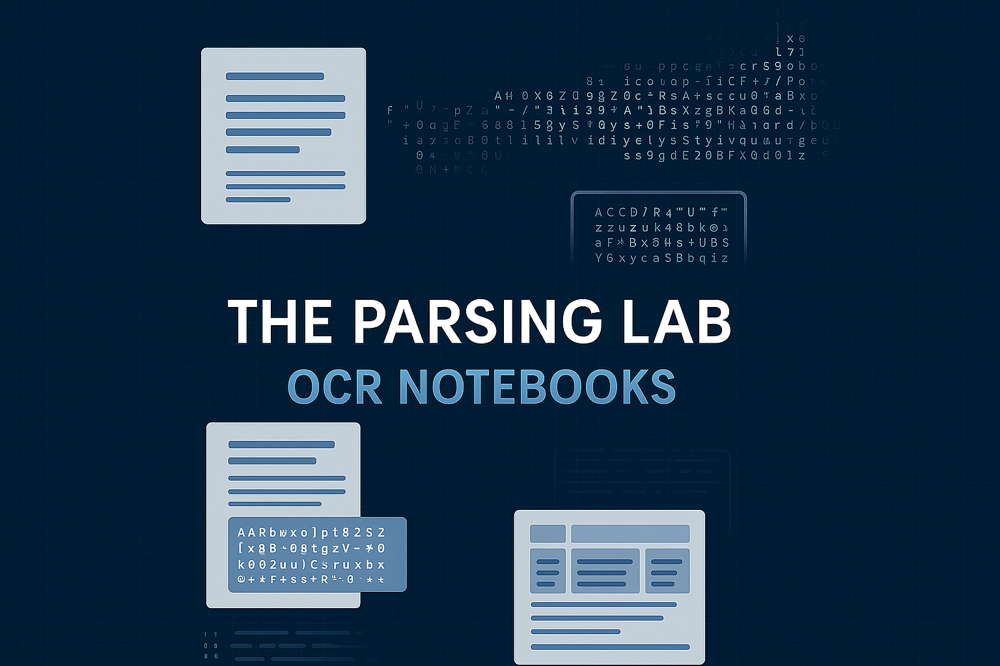

# 📝 Docs Parsing Techniques


A curated collection of Jupyter notebooks for experimenting with state-of-the-art OCR, document parsing, table extraction, and chart understanding techniques. This repository enables easy benchmarking and practical usage of the latest open-source and cloud-based solutions for document image processing.

---

## 🚀 Notebooks Overview

| Notebook                                                                                                                                                                            | Description                                                         |
| ----------------------------------------------------------------------------------------------------------------------------------------------------------------------------------- | ------------------------------------------------------------------- |
| [bytedance-dolphin-image-parsing.ipynb](https://github.com/AdemBoukhris457/Docs_Parsing_Techniques/blob/main/bytedance-dolphin-image-parsing.ipynb)                                 | Document page parsing with **Dolphin** by ByteDance                 |
| [Llama-3.1-Nemotron-Nano-VL-8B-V1_parsing_documents.ipynb](https://github.com/AdemBoukhris457/Docs_Parsing_Techniques/blob/main/Llama-3.1-Nemotron-Nano-VL-8B-V1_parsing_documents.ipynb)                                 | Testing the performance of document parsing with **Llama-3.1-Nemotron-Nano-VL-8B-V1**                 |
| [docling-documents-parsing-and-tables-extraction.ipynb](https://github.com/AdemBoukhris457/Docs_Parsing_Techniques/blob/main/docling-documents-parsing-and-tables-extraction.ipynb) | Parsing and table extraction with **Docling**                       |
| [typhoon-ocr-7b-docs-pages-parser.ipynb](https://github.com/AdemBoukhris457/Docs_Parsing_Techniques/blob/main/typhoon-ocr-7b-docs-pages-parser.ipynb) | Evaluating **Typhoon_ocr_7b** Document Parsing Capabilities Across Various Use Cases                    |
| [florence-2-large-ocr-documents-pages.ipynb](https://github.com/AdemBoukhris457/Docs_Parsing_Techniques/blob/main/florence-2-large-ocr-documents-pages.ipynb)                       | OCR of document pages using **Florence 2 Large**                    |
| [florence-2-large-ocr-images-real-life-scenarios.ipynb](https://github.com/AdemBoukhris457/Docs_Parsing_Techniques/blob/main/florence-2-large-ocr-images-real-life-scenarios.ipynb) | Real-life scenario OCR with **Florence 2 Large**                    |
| [got-ocr2-0-docs-parsing.ipynb](https://github.com/AdemBoukhris457/Docs_Parsing_Techniques/blob/main/got-ocr2-0-docs-parsing.ipynb)                                                 | Document pages parsing with **GOT-OCR2.0** and **Gemini 2.5 Flash** |
| [marker-docs-parsing.ipynb](https://github.com/AdemBoukhris457/Docs_Parsing_Techniques/blob/main/marker-docs-parsing.ipynb)                                                         | Marker-based document parsing experiments                           |
| [mistralocr-docs-parsing.ipynb](https://github.com/AdemBoukhris457/Docs_Parsing_Techniques/blob/main/mistralocr-docs-parsing.ipynb)                                                 | Document parsing using **MistralOCR**                               |
| [monkeyocr-docs-pages-parsing.ipynb](https://github.com/AdemBoukhris457/Docs_Parsing_Techniques/blob/main/monkeyocr-docs-pages-parsing.ipynb)                                       | Document parsing with **MonkeyOCR**                                 |
| [nanonets-OCR-s\_docs\_parsing.ipynb](https://github.com/AdemBoukhris457/Docs_Parsing_Techniques/blob/main/Nanonets-OCR-s_docs_parsing.ipynb)                                       | Advanced document parsing using **Nanonets-OCR-s**                  |
| [ollama-llama3-2-vision-usage.ipynb](https://github.com/AdemBoukhris457/Docs_Parsing_Techniques/blob/main/ollama-llama3-2-vision-usage.ipynb)                                       | Using **Llama3-2 Vision** for document parsing                      |
| [paddleocr-3-0-docs-parsing.ipynb](https://github.com/AdemBoukhris457/Docs_Parsing_Techniques/blob/main/paddleocr-3-0-docs-parsing.ipynb)                                           | Parsing with **PaddleOCR 3.0** PP-StructureV3                       |
| [pix2text-docs-pages-parsing.ipynb](https://github.com/AdemBoukhris457/Docs_Parsing_Techniques/blob/main/pix2text-docs-pages-parsing.ipynb)                                         | Document parsing using **Pix2Text**                                 |
| [smoldocling-documents-understanding.ipynb](https://github.com/AdemBoukhris457/Docs_Parsing_Techniques/blob/main/smoldocling-documents-understanding.ipynb)                         | Document understanding with **SmolDocling**                         |
| [zerox-pdf-parsing.ipynb](https://github.com/AdemBoukhris457/Docs_Parsing_Techniques/blob/main/zerox-pdf-parsing.ipynb)                                                             | PDF parsing experiments with **Zerox**                              |
| [qwen2-vl-2b-docs-parsing.ipynb](https://github.com/AdemBoukhris457/Docs_Parsing_Techniques/blob/main/qwen2-vl-2b-docs-parsing.ipynb)                                                             | Documents pages parsing with **Qwen2-VL-2B**                              |
| [OCRFlux_3B_Docs_Parsing.ipynb](https://github.com/AdemBoukhris457/Docs_Parsing_Techniques/blob/main/OCRFlux_3B_Docs_Parsing.ipynb)                                                             | Document parsing with **OCRFlux-3B** on Lightning AI                              |


---

## 📑📊 Tables and Charts Recognition

This section includes notebooks focused on table and chart detection, structure recognition, and extraction from documents. It covers various open-source approaches and benchmarks for understanding table and chart layouts and content.


| Notebook                                                                                                                                                                              | Description                                                         |
| ------------------------------------------------------------------------------------------------------------------------------------------------------------------------------------- | ------------------------------------------------------------------- |
| [unitable-testing-for-table-structure-recognition.ipynb](https://github.com/AdemBoukhris457/Docs_Parsing_Techniques/blob/main/unitable-testing-for-table-structure-recognition.ipynb) | Testing table detection and structure recognition with **UniTable** |
| [deepdoctection-tables-recognition.ipynb](https://github.com/AdemBoukhris457/Docs_Parsing_Techniques/blob/main/deepdoctection-tables-recognition.ipynb)                              | Evaluating **Deepdoctection** for table extraction across varied structures |
| [gemini-2-5-pro-on-chart-and-table-extraction.ipynb](https://github.com/AdemBoukhris457/Docs_Parsing_Techniques/blob/main/gemini-2-5-pro-on-chart-and-table-extraction.ipynb)       | Chart/table extraction using **Gemini 2.5 Pro**                     |
| [deplot-plots-to-tables-converter.ipynb](https://github.com/AdemBoukhris457/Docs_Parsing_Techniques/blob/main/deplot-plots-to-tables-converter.ipynb)       | Converting Charts into Tables with **DePlot**                     |


---

## 📖 Project Goals

* **Benchmark** different OCR/document parsing models on real documents.
* **Demonstrate** table, chart, and text extraction workflows.
* **Compare** open-source and commercial solutions.
* **Provide** ready-to-use code snippets for rapid prototyping.

---

## 🛠️ Usage

1. **Clone the repository:**

   ```bash
   git clone https://github.com/AdemBoukhris457/Docs_Parsing_Techniques.git
   ```
2. **Install dependencies** as needed for each notebook (see the first cells of each `.ipynb` for requirements).
3. **Launch Jupyter Notebook or JupyterLab** and open any notebook of interest.
4. **Run the cells** and adapt the code for your documents.

---

## 📌 Notes

* Some notebooks require model weights or API keys, check comments in each notebook for details.
* Results, insights, and sample outputs are provided inline.

---

## 🔗 Related Resources

📂 You can find more notebooks, experiments, and datasets related to document parsing and OCR on my Kaggle profile:
👉 [https://www.kaggle.com/ademboukhris/code](https://www.kaggle.com/ademboukhris/code)

---

## Star History

[](https://www.star-history.com/#AdemBoukhris457/Docs_Parsing_Techniques&Date)